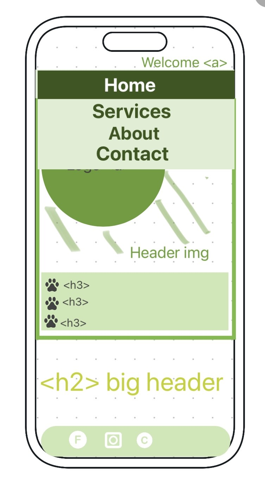

# Walking With Talitha - Professional Dog Walking and Sitting Services

## PROJECT OVERVIEW

Welcome to the README for "Walking With Talitha". This web design aims to create a professional website for an independent dog walking and sitting service business. The website will reflect a high level of care and professionalism while maintaining a warm and inviting atmosphere to showcase trustworthiness and qualifications in handling beloved pets.

The business owner, after great success in starting her own business back in 2020 has decided the next evolutionary stage for this continuously expanding business – a brand-new, high-quality website!

## FEAUTURES
Key Features

      1.  Navigation Bar: The navigation bar provides easy access to Home, Services, About, and Contact sections, featuring a header image of a dog walking in fields and the business logo.

      2.  Home Page: Features a gallery wall with images of happy dog customers and customer reviews to create an immediate sense of trust. Headers include "Welcome to Walking With Talitha," "Dog Walking and Sitting Services," "Fully Insured & DBS Registered," and "Serving Trowbridge and Surrounding Areas."

      3.  Services: A table displays a comprehensive list of services, along with pricing and a reminder that pricing may vary based on unique customer needs. Detailed explanations of each service are also provided.

      4.  About: This section introduces the business owner, her experience, and the personal story behind the business, including a tribute to her own pet. Images are included to create a personal connection.

      5.  Contact: Provides links to the business's Instagram and Facebook accounts, along with icons for easy access. The website also displays the business's phone number and email address. A Google Map shows the business's location. A contact form allows visitors to send messages that get delivered to the owner's email.

      6.  Future Features: The README acknowledges potential future features, such as implementing a booking system for customer convenience.

   
## UX/UI SECTION

### Site Goals:

Professionalism: In the ever-growing pet care industry, a website provides the professional image needed to stand out from the crowd. Impress potential clients with a sleek, modern, and easy-to-navigate site.

Targeting the Right Audience:  potential clients aren't just on social media – they're everywhere online. This website will reach to connect with those actively searching for reliable and trusted dog care services.

### How the Website Will Accomplish This:

*Striking Design:  will reflect dedication to excellence. It'll be visually appealing, modern, and fully responsive, ensuring it looks great on all devices.
*User-Friendly Navigation: We'll create an intuitive structure, making it effortless for visitors to find the information they need. Whether it's pricing, services, or contact details, it's all just a click away.
*Engaging Content: content showcase love for dogs, and highlight the business owners expertise. People will feel like they already know her.
*SEO Optimization: optimize site for search engines, making it easier for potential clients to discover the services online. Due to being a local to the area the site will need to make sure targeted for that area.

### Who This Website Is Intended For:

Local Pet Parents: For those seeking a trustworthy dog walking and sitting service, in their area. Also, those who are looking to treat their pets to day trips out, or those who are looking to socials their dogs.

Busy Professionals: People with demanding schedules will appreciate the convenience of a dedicated professional tending to their pet’s needs.

Holiday Goers: The worries of leaving your pet behind made at ease with services of house sitting so pets can keep to the comfort of their house with a trusted friend to keep them company and safe while the owners can relax while away.

Those with injuries or disabilities: Those that may not be physically able to keep up with the demand of their energetic pooch.

### USER Experience

The website prioritizes user experience for people with disabilities, offering clear, informative, and comforting content. The homepage provides a warm and welcoming atmosphere with a gallery or collage of happy furry dog customers, accompanied by images of reviews integrated into the visuals.

### USER Stories-

#### As A Pet Owner:       
*I want to find a local dog walker service to care for my pup while I'm at work.
*I want to discover a local dog walker business to ensure my dog's well-being during my vacation.
*I want to connect with a local dog walker for my puppy's exercise and socialization.
*I want to find a local dog walker service for my dog's exercise needs due to my limited mobility.
*I want to hire a local dog walker with flexible services that can adapt to my changing schedule.
*I want to locate a local dog sitter capable of caring for all my dogs.
*I want to connect with a local, experienced dog walker, who is trusted in the community for my fearful dog's special needs.
*I'm looking for a reliable local dog walker, and it's essential for me to have access to reviews that reflect their service quality. I want to make sure they come highly recommended and can provide the best care for my furry friend.
*I want to find a local dog sitter business to care for my dog during a special event.
*I want to locate a reliable local dog walker company that provides on-demand services for my unpredictable work schedule.
*As a dog owner, I want to visit the individual dog walker's website to learn about their experience, services, and pricing, so I can make an informed decision about hiring them to walk my dog.
*As a dog owner, I want to access a calendar on the website to check the available time slots for dog walks and choose a convenient time for my dog's exercise.
*As a dog owner, I want to read reviews and testimonials from other clients on the website to gain confidence in the dog walker's reliability and the quality of their service.
         
#### As Business Owner:   
*I want to have a professional and informative website that showcases my services, experience, and testimonials, so I can attract potential clients and build trust with them.
*As a business owner, I want to have an easy-to-use content management system on my website, allowing me to update my services, pricing, and availability in real-time, so I can keep my clients informed and my website up-to-date.
*I want to include a contact form on my website, enabling potential clients to reach out to me easily, so I can quickly respond to inquiries and schedule dog walking appointments.
*I want to integrate a scheduling and booking system into my website, allowing clients to request and book dog walks online, streamlining the appointment process and reducing administrative tasks.
*I want to utilize analytics and reporting tools on my website to track user engagement, monitor the effectiveness of marketing efforts, and gather data to make informed decisions to grow and improve my dog walking business and attract more customers.  

### DESIGN
Typography and Color Scheme
The website's color scheme is inspired by the business logo, emphasizing greens and pastel light colors for a visually appealing contrast. The font choice, "Wellfleet," is both readable and gentle, in line with the nurturing image the business aims to project.

### WIREFRAMES
#### Mobile Screens
*Home Screen 
    *
*included two essential anchors on all screen sizes:
Logo Anchor: The website logo, when clicked, serves as an anchor to bring the viewer back to the index.html page, offering a convenient way to return to the homepage.
Top Right Welcome Sign: In the top right corner of the navigation bar, you will find a welcome sign. Clicking this sign also acts as an anchor to return to the homepage, ensuring easy and intuitive navigation.    
    *
**The navigation toggle bar is positioned at the top of the mobile screen. Placing it at the top ensures it's the first element a viewer sees when they access the website. This prominent placement enhances accessibility and encourages users to interact with the navigation options.        

### Database structure(PP3, PP4, PP5)

## TESTING
### Validator Testing
(W3C VALIDATOR AND JISSAW VALIDATOR INCLUDE IMG)
### Unfixed Bugs

## DEPLOYMENT
### Steps

## SOURCE CITATION

### TECHNOLOGIES
*Photoshop --To create wireframes
*HTML --To create content
*CSS --To style content
*Codeanywhere --Integrated Development Environment  (write, edit and develop code)
*Github --Host source code and deploy
*ChatGBT --Explaining elements in more detail/ reminding me on how create the code I want/ giving me examples of good content for my site ext.
*Favicon.io --Favicon Generator
*Replit --First coding platform I practiced with
*Wave Evaluation Tool --WILL USe
*W£C validator --WILL USE

### CREDITS
*Chrome DevTools --Inspect elements/ Development tools
*Love Running Project --Initial direction
*Love Runnig README --Initial direction
*Code Institute --Initial learning
*Google
*Google Fonts -- Fonts used
*Font Awesome --Icons used
*Favicon.io <https://favicon.io/favicon-converter> --Favicon Generator
*https://developer.mozilla.org/en-US/ --Referancing/ reminding of HTML and CSS codes
*WomansDay/ "70 Paws-itively Hilarious Dog Puns to Use as Instagram Captions and More" https://www.womansday.com/life/pet-care/a30928651/dog-puns/ --For the great dog pun inspiration.
*AsiaWi/hygge_life https://github.com/AsiaWi/hygge_life/tree/main --README file
*Cheat Sheet https://docs.emmet.io/cheat-sheet/ --code shortcuts
*Talitha Bailey/ Walking With Talitha --Being my muse

### MEDIA
*Walking With Talitha Logo --Designed by Amber Andrews (me) intellectual property of Talitha Bailey, the owner of 'Walking with Talitha'.
*The Header image --featuring the dog, is the intellectual property of Talitha Bailey. It has been edited with an AI-generated background from Pixelcut [Link to Pixelcut: https://www.pixelcut.ai/]."
*All images on this website, including those on the Home Page, About page gallery, Services page background, etc., are used with permission and are the intellectual property of Talitha Bailey, the owner of 'Walking with Talitha' [Link to Facebook page: https://www.facebook.com/WalkingwithTalitha.]
*Font Awesome --Icons used
*Favicon.io <https://favicon.io/favicon-converter> --Favicon Generator

## FUTURE FEATURES
