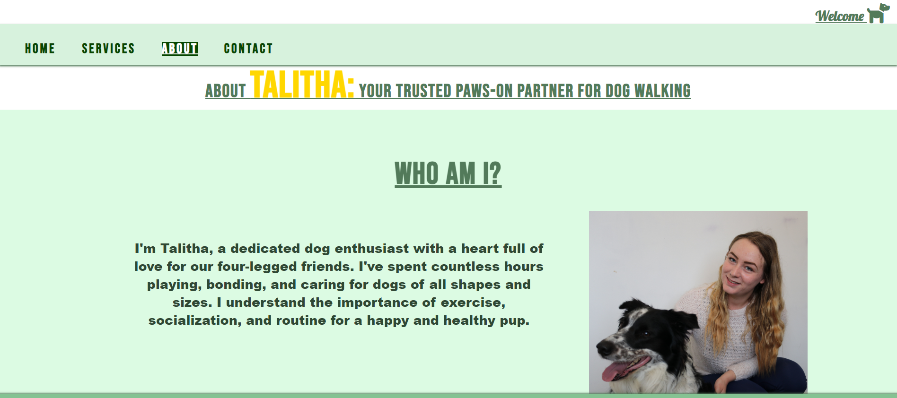
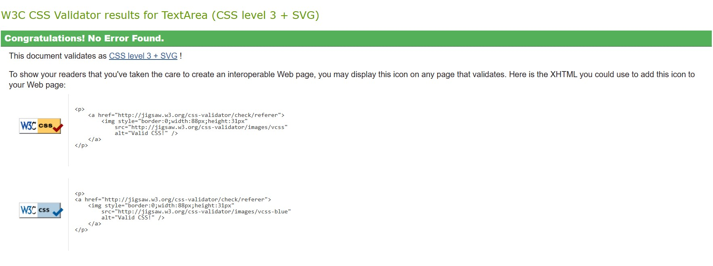

# Walking With Talitha - Professional Dog Walking and Sitting Services

## PROJECT OVERVIEW

Welcome to the README for "Walking With Talitha". This web design aims to create a professional website for an independent dog walking and sitting service business. The website will reflect a high level of care and professionalism while maintaining a warm and inviting atmosphere to showcase trustworthiness and qualifications in handling beloved pets.

The business owner, after great success in starting her own business back in 2020 has decided the next evolutionary stage for this continuously expanding business – a brand-new, high-quality website!

## FEAUTURES

## Key Existing Features

### Navigation
The navigation bar is a consistent feature located at the top of every page on our website. It provides users with easy access to key sections of the site. Here are some important details about the navigation bar:
Welcome Message: In the top right corner of the navigation bar, you'll find a "Welcome" text accompanied by a charming dog icon. This "Welcome" message also serves as an anchor link, allowing users to quickly return to the home page by clicking on it. - This element stays the same for all screen sizes.

Menu Options: The navigation bar includes the following menu options and links:
Home: Takes you to the main page of the website.
Services: Link directs user to services page.
About: Link directs user to about page.
Contact: Link directs user to contact information and form.

Visual Feedback: When a menu option is selected, the text will transform to white, with a dark green background, and will be underlined. This visual feedback is designed to enhance the user experience, making it clear which page you are currently on.

Fixed Position: The navigation bar is "fixed," which means it remains at the top of the screen even as users scroll down the page. This design feature ensures that users don't have to scroll back to the top when they want to access a different page, providing a seamless and convenient browsing experience.

### Responsive Navigation Bar

This website features a responsive navigation bar to ensure an optimal viewing experience on smaller screens, such as mobile devices. Here's how it adapts:

* Mobile-Friendly Design: On smaller screens, the navigation bar undergoes a transformation. Instead of displaying all pages simultaneously, we utilize a menu icon, conserving screen space while keeping the font size intact.
* Dropdown Menu: When users click the menu icon, a dropdown menu appears, presenting the available options in a clear and user-friendly manner. This makes it easy for users to select the page they wish to visit.
* Auto-Collapse: The dropdown menu automatically collapses once a page has been selected, maintaining a tidy and uncluttered interface.
* Consistent Styling: Just like in the desktop version, the selected page on the mobile navigation bar maintains the same styling, distinguishing it from the other available options. This ensures a seamless and visually consistent user experience across all screen sizes.

* *

### Web Tab

When you open the website in a browser tab, you will immediately notice the presence of the business name
'Walking With Talitha' along with a favicon displaying the logo of the business owner. This design element ensures that viewers can easily identify the tab and contributes to a polished and professional appearance.

### Header Image & Logo

* The header, featuring a border collie set against a green field backdrop that matches the color scheme of the web page, 
provides an immediate visual cue about the site's theme. Underneath the header, you'll find information that clarifies the 
site's purpose, which is dog walking and sitting services. It also highlights the business owner's qualifications in the 
industry and provides the location of the business. These elements are thoughtfully arranged to ensure a clean and uncluttered 
appearance.

* The logo, which serves as a home page link, is subtly positioned in the corner of the header image. It doesn't overpower the 
design but remains noticeable, akin to a brand label.

* As demonstrated in the responsive navigation elements shown in previous images, the header image adapts to smaller screens, 
allowing the headers to occupy more space and the logo to increase in size, fitting nicely within the curve of the dog's back.

### Home Page 'Your Trusted Dog Walking Companion'

#### Responsive Home Page 'Your Trusted Dog Walking Companion'

### Footer

* In line with the green-themed design, the footer takes on a slightly darker shade compared to the navigation and header. 
This subtle contrast enhances the page's sharpness against the white background of the main content.

* The footer remains a fixed element throughout, ensuring that social media icons and links, as well as the 
copyright notice, are constantly visible to the visitors. The business owner maintains active profiles on Facebook and 
Instagram. When users click on the icons, the corresponding social media sites open in separate tabs, clearly indicated by 
Arial labels to convey this action.

### Services Page

#### 'Su-Paw-Star Service' table section

* On the services page, the primary feature is a table that outlines the different service types, their associated costs, 
and the typical timeframes. This table serves as an informative section of the site, enabling visitors to easily understand 
the owner's offerings and pricing structure.

* Beneath the table, it is explained that the prices and durations of services can vary based on individual dog characteristics
 and the owner's specific requirements, emphasises the highly personalized nature of the service. 
* This information is presented in keeping with the current color theme, which incorporates dark and light greens with subtle 
hints of yellow, enhancing the visual appeal. The table is neatly outlined with a yellow border, and the top row is made more 
prominent, clearly labeled as 'Service Cost' and 'Times'

#### 'Paw-sibilities: Our Service in Bone-fide Detail' service breakdown section

### About Page

#### Business Owner Intro (section on About Page)

* In the "About" section, we first encounter a brief introduction to the business owner, accompanied by an image of her 
alongside her loyal border collie, a recurring presence throughout the website. This personal touch reinforces the independent 
nature of the business and allows viewers to develop a sense of the person they may entrust with their cherished pets.

* On larger screens, the image is positioned beside the introductory text, with a background color resembling the navigation 
bar. This design choice serves to break up the page layout, eliminating unnecessary white space and preventing the page from 
appearing overly empty.

##### Responsive Business Owner Intro (section on About Page)

* On smaller screens, the introductory text seamlessly overlays the full-width image, eliminating the need for a color background, 
creating a more compact and aesthetically pleasing display.

#### Reasons Why (section on About Page)

* The "Reasons Why" section on the About page features concise, punchy sentences designed to provide viewers with compelling 
reasons to choose her as their dog walker/sitter. Key buzz words are highlighted in bold to make them stand out, with yellow 
text for high contrast against the green background

#### Responsive About page

#### Happy Customer Gallery on About Page

#### Responsive Happy Customer Gallery on About Page

### Contact Page

#### Contact Form

#### Responsive Contact Form

#### Confirmation Page- New Tab upon Correct Completion Of Form

#### Maps

#### Responsive Maps
 

   
## UX/UI SECTION

### Site Goals:

Professionalism: In the ever-growing pet care industry, a website provides the professional image needed to stand out from the crowd. Impress potential clients with a sleek, modern, and easy-to-navigate site.

Targeting the Right Audience:  potential clients aren't just on social media – they're everywhere online. This website will reach to connect with those actively searching for reliable and trusted dog care services.

### How the Website Will Accomplish This:

* Striking Design:  will reflect dedication to excellence. It'll be visually appealing, modern, and fully responsive, ensuring it looks great on all devices.
* User-Friendly Navigation: We'll create an intuitive structure, making it effortless for visitors to find the information they need. Whether it's pricing, services, or contact details, it's all just a click away.
* Engaging Content: content showcase love for dogs, and highlight the business owners expertise. People will feel like they already know her.
* SEO Optimization: optimize site for search engines, making it easier for potential clients to discover the services online. Due to being a local to the area the site will need to make sure targeted for that area.

### Who This Website Is Intended For:

* Local Pet Parents: For those seeking a trustworthy dog walking and sitting service, in their area. Also, those who are looking to treat their pets to day trips out, or those who are looking to socials their dogs.

* Busy Professionals: People with demanding schedules will appreciate the convenience of a dedicated professional tending to their pet’s needs.

* Holiday Goers: The worries of leaving your pet behind made at ease with services of house sitting so pets can keep to the comfort of their house with a trusted friend to keep them company and safe while the owners can relax while away.

* Those with injuries or disabilities: Those that may not be physically able to keep up with the demand of their energetic pooch.

### USER Stories-

#### As A Pet Owner:

* I want to find a local dog walker service to care for my gog while I'm at work.
* I want to discover a local dog walker business to ensure my dog's well-being during my vacation.
* I want to connect with a local dog walker for my puppy's exercise and socialization.
* I want to find a local dog walker service for my dog's exercise needs due to my limited mobility.
* I want to hire a local dog walker with flexible services that can adapt to my changing schedule.
* I want to locate a local dog sitter capable of caring for all my dogs.
* I want to connect with a local, experienced dog walker, who is trusted in the community for my fearful dog's special needs.
* I'm looking for a reliable local dog walker, and it's essential for me to have access to reviews that reflect their service quality. I want to make sure they come highly recommended and can provide the best care for my furry friend.
* I want to find a local dog sitter business to care for my dog during a special event.
* I want to locate a reliable local dog walker company that provides on-demand services for my unpredictable work schedule.
* As a dog owner, I want to visit the individual dog walker's website to learn about their experience, services, and pricing, so I can make an informed decision about hiring them to walk my dog.
* As a dog owner, I want to access a calendar on the website to check the available time slots for dog walks and choose a convenient time for my dog's exercise.
* As a dog owner, I want to read reviews and testimonials from other clients on the website to gain confidence in the dog walker's reliability and the quality of their service.
         
#### As Business Owner:

* I want to have a professional and informative website that showcases my services, experience, and testimonials, so I can attract potential clients and build trust with them.
* As a business owner, I want to have an easy-to-use content management system on my website, allowing me to update my services, pricing, and availability in real-time, so I can keep my clients informed and my website up-to-date.
* I want to include a contact form on my website, enabling potential clients to reach out to me easily, so I can quickly respond to inquiries and schedule dog walking appointments.
* I want to integrate a scheduling and booking system into my website, allowing clients to request and book dog walks online, streamlining the appointment process and reducing administrative tasks.
* I want to utilize analytics and reporting tools on my website to track user engagement, monitor the effectiveness of marketing efforts, and gather data to make informed decisions to grow and improve my dog walking business and attract more customers. 

### DESIGN
Typography and Color Scheme
The website's color scheme is inspired by the business logo, emphasizing greens and pastel light colors for a visually appealing contrast. The font choice, "Wellfleet," is both readable and gentle, in line with the nurturing image the business aims to project.
---INSERT MOOD BORED WITH COLORS IMAGES AND TYPOGRapghy----

## FUTURE FEATURES

* Booking or Scheduling System: An optional feature that allows clients to book and schedule services online. This can include a calendar, availability, and payment options. Saving time on the owner doing manual admin.
* Testimonials and Reviews page: A dedicated section for client testimonials and reviews that they can put straight on the site.
* Blog or News Section: Articles, updates, or blog posts related to dog care, training tips, or pet health. Regularly updated content to engage visitors and position the dog walker as an expert. Also gets the viewers/customers enaging with the site on a social level not just a consumer level.

### WIREFRAMES

#### Mobile Screens

##### Home Screen 

        
Included two essential anchors on all screen sizes:
Logo Anchor: The website logo, when clicked, serves as an anchor to bring the viewer back to the index.html page, offering a convenient way to return to the homepage.
Top Right Welcome Sign: In the top right corner of the navigation bar, you will find a welcome sign. Clicking this sign also acts as an anchor to return to the homepage, ensuring easy and intuitive navigation.

        
 The navigation toggle bar is positioned at the top of the mobile screen. Placing it at the top ensures it's the first element a viewer sees when they access the website. This prominent placement enhances accessibility and encourages users to interact with the navigation options.

##### Service Screen

* Please note at this point that the wireframe images, specifically the nav and footer do not match the previous wireframes, they would still have the same layout on the web doc. 
The nav and footer would move as the screen scrolls being in a fixed or sticky positions. The heading elements and image would also be on this page like all the other pages but would not be visable as we scroll down.
The service page is a vital one in this site as has all the importan information about the services provided, it needs to be readable and clear so the viewer has all the information possible to hand. Would start with a table element then after a more detail explantion of each service underneath.

##### About Screen

*Aim to make this section more intimate by allowing viewers to get to know the owner on a personal level. Through a brief and friendly introduction, we provide insights into her background, passion for the business, and what drives her commitment to providing exceptional services. This personal touch is a key factor in securing viewers' trust to create a sense of familiarity and relatability, building trust and rapport with the audience.
Incorporating images of reviews from satisfied customers adds authenticity and credibility through the gallery showcasing these qualities. To add an endearing and charming element to our "About" section, we include images of our happy dog customers. This not only showcases the love and care we provide to our furry clients but also brings a smile to the viewer's face. It's a delightful way to create an emotional connection with our audience.

        
##### Contact Screen

* One of the primary features of the "Contact" page is the inclusion of a user-friendly contact form. This form is designed to allow visitors to email the owner directly through the website. It provides an efficient and convenient means of communication, particularly for those who prefer not to phone or navigate through various social media channels. With all fields classed as REQUIRED, no accidental email will be sent without all the require information being keyed in.
For those who prefer to explore the owner's social media accounts, we've placed prominent links in the footer of the website. These links are designed to open in a new tab, ensuring that users don't lose access to the website

#### Medium to Large screens Wireframes

### TECHNOLOGIES

* Mockup https://getmockup.app/ --To create wireframes
* HTML --To create content
* CSS --To style content
* Codeanywhere --Integrated Development Environment  (write, edit and develop code)
* Github --Host source code and deploy
* Chrome DevTools --inspect/ lighthouse
* Favicon.io --Favicon Generator
* Replit --First coding platform I practiced with
* Wave Evaluation Tool --WILL USe
* W2C validator --WILL USE
* Am I Responsive? - ui.dev <https://ui.dev/amiresponsive> --showcasing sites responsiveness on multiple screens
* ChatGBT --Explaining elements in more detail/ reminding me on how create the code I want/ giving me examples of good content for my site ext.

## TESTING

### Manual Testing

Manual testing performed, to ensure website performs well on different devices.

Devices --

* Galaxy Fold
* iPhone 4
* iPhone 12 Pro
* iPhone 14 Pro Max
* iPad
* iPad mini
* iPad pro
* Galaxy Note 3
* Galaxy 9+
* Nest Hub
* Microsoft Lumia 950
* Kindle Fire HDX

Issues
Fix
ISsues
Fix

* With the use of Chrome Devtools able to check differant device sizes

    * Right click on web
    * Select inspect
    * Select device of choice, top left of screen.

* Also with the help of this dool can choose option for responsive to change the height and width manually

    * Right click on web
    * Select inspect
    * Select Responsive, top left of screen.

#### Function Testing

* Anchor to Home page LinK

    * Checked when either anchor is clicked page goes to home page. Checked each html file for both Anchors. All links work as expected.

|ANCHOR LINK | DESTINATION PAGE|
|------------|-----------------|
|Welcome     |  index.html     |
|Logo        |  index.html     |

* Navigation Links

    * All links have been checked from each page to make sure they take us to correct page. All links work as expected.

|NAVIGATION LINK| DESTINATION PAGE|
|---------------|-----------------|
|Home           | index.html      |
|Services       | service.html    |
|About          | about.html      |
|Contact        | contact.html    |

* Footer Social Media Icon Links

    * Both icons have the correct link and both links open in a new tab to the correct webpage. Every html page was tested manually

|SOCIAL MEDIA LINK/ ICON  |               DESTINATION PAGE                 |   PAGE OPENS IN NEW TAB     |
|-------------------------|------------------------------------------------|-----------------------------|
|Facebook icon            |  https://www.facebook.com/WalkingwithTalitha   |            Yes              |
|Instagram icon           |  https://www.instagram.com/walkingwithtalitha/ |            Yes              |

* Contact Page -- Maps 

    * Visually can see map and map location on Contact Page on all screen sizes. When selected new tab is open of the Google maps link of Trowbridge, as expected.

|GOOGLE MAP IFRAME          |               DESTINATION PAGE                                                                                                                                                       |   PAGE OPENS IN NEW TAB     |
|---------------------------|--------------------------------------------------------------------------------------------------------------------------------------------------------------------------------------|-----------------------------|
|   Map of Trowbridge          https://www.google.com/maps/place/Trowbridge/@51.319138,-2.205962,11z/data=!4m6!3m5!1s0x48717d0a13b4a533:0xfcf81a2e9c24722d!8m2!3d51.319664!4d-2.208853!16zL20vMDE4eWxi?hl=en&gl=GB |            Yes              |

* Contact Page -- Form

    * All inputs, including those with "type=text" and "type=email" attributes, have been set to "required." If one or more fields are left incomplete, the "send message" option does not function, which aligns with the expected behavior.

         

    * In the case of the email field, it is designed to reject incorrect email formats, as anticipated.

        

    * All input fields, with the exception of the message box, are equipped with an autocomplete attribute, tailored to ensure accessibility for users with specific needs.

        

    * When all fields are submitted correctly, the user is directed to the "confirmation.html" page, this page opens in a new tab,which is in line with the expected outcome.

        

### Validator Testing

* HTMl -- No errors were found when code inputted through official WSC Validator. --https://validator.w3.org/#validate_by_input

    *

    * Steps -- 
        * Open deployed document
        * Right click page
        * View page source / Ctrl+U
        * (Page Html code will open in next tab) Copy all Ctrl+A Ctrl+C
        * Open <https://validator.w3.org/>
        * Click the third option ‘Validate by direct input’
        * In text field paste code/ Ctrl+V
        * Click button below labelled ‘Check’
        * See for any errors in code/ No errors in document message.
        * Repeat process for each html file.

* CSS -- No errors were found when code inputted through official WSC Validator. (JIGSAW) --https://jigsaw.w3.org/css-validator

    

    * Steps --

        * Open deployed document
        * Right click page
        * View page source / Ctrl+U
        * (Page Html code will open in next tab) click on stylesheet css path <link rel="stylesheet" href="assets/css/style.css">
        * Copy all Ctrl+A Ctrl+C
        * Open <https://jigsaw.w3.org/css-validator/>
        * Click the third option ‘Validate by direct input’
        * In text field paste code/ Ctrl+V
        * Click button below labelled ‘Check’
        * See for any errors in code/ No errors in document message.

### Lighthouse 
Home--Desktop & Mobile

Services--Desktop & Mobile

About--Desktop & Mobile

Contact--Desktop & Mobile

Confirmation-- Desktop & Mobile

### Unfixed Bugs

## DEPLOYMENT

The Walking With Talitha site was deployed to GitHub Pages.

### Steps

* Go to Github repositories.
* Click on "Settings" in the top right of screen.
* Click on "Pages"(tab on the left sidebar under ‘Code and automation’ eight option down)
* Scroll to ‘Build and deployment’ section.
* Find sub-section ‘Branch’
* From drop-down menu "none"/"select branch" choose source "main" (or "master")
* Click "Save"
* Wait until you can see a link for deployed page within Github Page section, wait as this can take a while.
* Once the page updates you will see a message: Your site is live at https://amberrosea.github.io/walkingwithtalitha/

## SOURCE CITATION

### CREDITS

* Chrome DevTools --Inspect elements/ Development tools
* Love Running Project --Initial direction
* Love Runnig README --Initial direction
* Code Institute --Initial learning
* Google
* Google Fonts -- Fonts used
* Font Awesome --Icons used
* Favicon.io <https://favicon.io/favicon-converter> --Favicon Generator
* https://developer.mozilla.org/en-US/ --Referancing/ reminding of HTML and CSS codes
* WomansDay/ "70 Paws-itively Hilarious Dog Puns to Use as Instagram Captions and More" https://www.womansday.com/life/pet-care/a30928651/dog-puns/ --For the great dog pun inspiration.
* https://www.we-love-pets.co.uk/ --For layout inspo
* AsiaWi/hygge_life https://github.com/AsiaWi/hygge_life/tree/main --README file
* Cheat Sheet https://docs.emmet.io/cheat-sheet/ --code shortcuts
* Rohit Sharma (Mentor) -- For guidence and edvice.
* Talitha Bailey/ Walking With Talitha --Being my muse

### MEDIA

* Walking With Talitha Logo --Designed by Amber Andrews (me) intellectual property of Talitha Bailey, the owner of 'Walking with Talitha'.
* All images on this website, including those on the Header,Home Page, About page gallery, Services page background, etc., are used with permission and are the intellectual property of Talitha Bailey, the owner of 'Walking with Talitha' [Link to Facebook page: https://www.facebook.com/WalkingwithTalitha.]
* Font Awesome --Icons used
* Favicon.io https://favicon.io/favicon-converter --Favicon Generator
* Typography -- Google Fonts